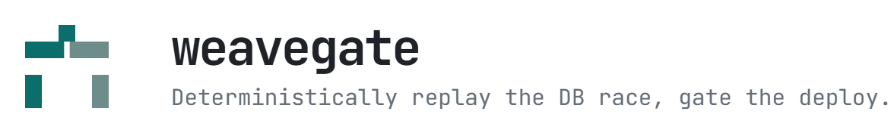

  
  

  <b>Making unreproducible failures reproducible, and unverifiable judgments checkable.</b>
   
  <i>A result is trustworthy only when someone else can reproduce it from the same inputs.</i>

 

<a href="https://github.com/weavegate/weavegate">
  <picture>
    <source media="(prefers-color-scheme: dark)" srcset="assets/weavegate-dark.png">
    
  </picture>
</a>

A race in a transactional `read → decide → write` workflow breaks once in production, then never again in a test.

- **Force the order ·** you place the sync-points, it walks the interleavings against real MySQL. No timing sleeps.
- **Judge the state ·** SQL rules decide whether the invariant held.
- **Keep the evidence ·** every saved schedule replayed its failure (20/20 × 3). Serial and staggered controls never did (0/100 × 3).
- **Planned ·** a `springtest` adapter for Spring Boot workflows, so the same replayed schedule can gate a real service in CI.

`Deterministic replay` `Go` `MySQL 8 / InnoDB`
  

<a href="https://github.com/WeaveTrail/WeaveTrail">
  <picture>
    <source media="(prefers-color-scheme: dark)" srcset="assets/weavetrail-dark.png">
    
  </picture>
</a>

A market-surveillance alert hands an investigator a candidate, not a finding. The executions behind it arrive from venues that disagree on field names, time precision, and decimal spelling, and a model's summary can read perfectly while skipping the rows it rests on.

- **Propose ·** a constrained mapper aligns each source column to one allowlisted transform, with its confidence and its evidence.
- **Approve ·** a reviewer signs off on that exact proposal by hash. A flagged field needs a justified override.
- **Replay ·** versioned code, not the model, decides whether a short-window price lift supports repeated aggressive buying by the approved actor group.
- **Abstain ·** five gates return `SUPPORTED`, `NOT_SUPPORTED`, or `INCONCLUSIVE`, and refusing to answer is a real verdict.

`Trust boundaries` `TypeScript` `Next.js`

 

**Team projects**

| Project | What it does |
|---|---|
| [Ongi Device](https://github.com/Ongi-Team/ongi-device) | Medication-assistance firmware that stays correct through network loss — RTC time executes the latest schedule held in memory, MQTT and HTTP reconcile it, and FreeRTOS tasks coordinate motor control and event reporting (C / ESP-IDF) |
| [Team-po / Server](https://github.com/Team-po/Server) | Transactional matching workflows and asynchronous generation of AI development guides for a team-project platform — the contended path behind weavegate (Java / Spring Boot) |

 

**Foundations** · where the concurrency, memory, and systems intuitions came from

| Project | What it involved |
|---|---|
| [xv6-kernel-extensions](https://github.com/jaeunda/xv6-kernel-extensions) | Stride scheduling, an inverted page table, and copy-on-write file-system snapshots inside the xv6 kernel (C) |
| [linux-system-programming](https://github.com/jaeunda/linux-system-programming) | Process control, daemons, signal handling, file locking, ext2 image traversal (C) |
| [compiler](https://github.com/jaeunda/compiler) | C-subset pipeline — RD/LR parsing, semantic analysis, symbol tables, code generation (C) |
